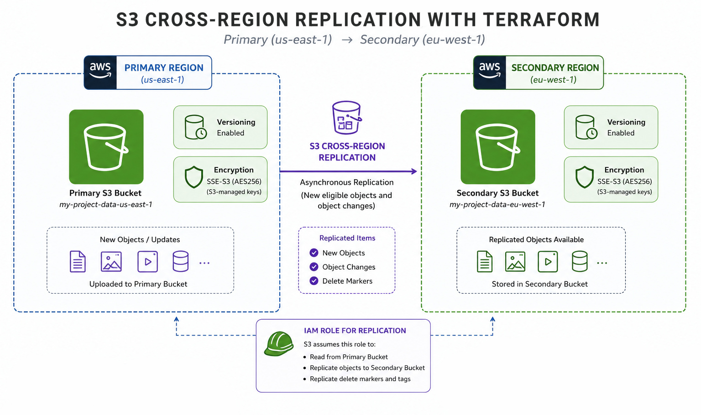

# S3-Cross-Region-Replication-with-Terraform
This project provisions Amazon S3 Cross-Region Replication (CRR) using Terraform.

**The configuration creates:**
- A primary S3 bucket in one AWS Region
- A secondary S3 bucket in another AWS Region
- S3 versioning on both buckets
- SSE-S3 encryption using AES256
- An IAM role and policy for S3 replication
- One-way replication from the primary bucket to the secondary bucket
- Delete-marker replication
- Terraform outputs for bucket names, ARNs, and the replication role

## Diagram

  
</
